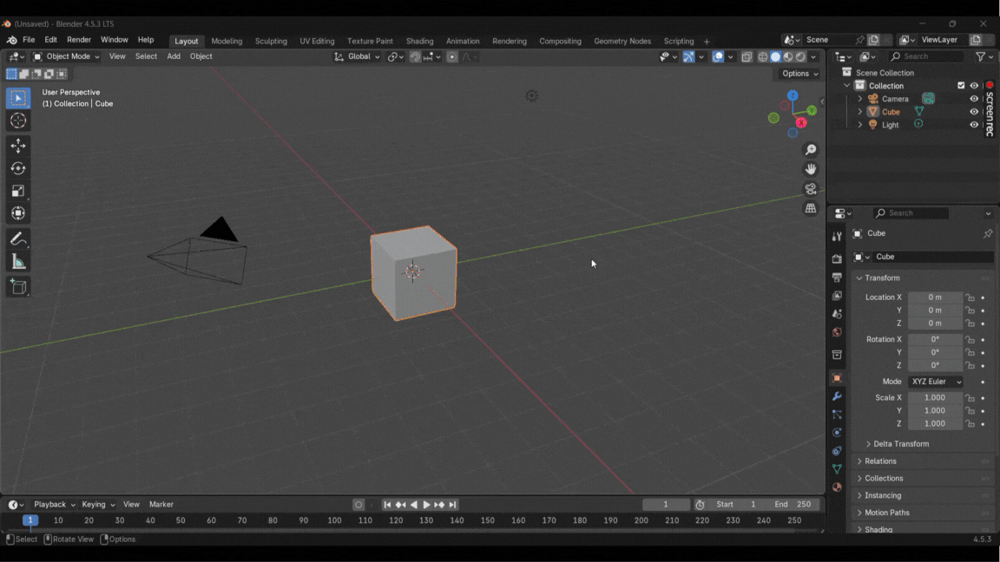

# 🎨 Live Variant Remapper

**Live Variant Remapper** is a modular  add-on that lets you instantly create **textured, color-remapped duplicates** of your 3D models — ideal for product variants, style tests, and visual experimentation without altering your original mesh.

---

## 🧩 Features

- 🎨 **Multi-Color Remapping:** Define multiple color pairs (source → target) to remap in a single click.
- 🧱 **Texture-Ready Materials:** Automatically creates texture-paint-ready base materials for clean color mapping.
- 💾 **Non-Destructive Workflow:** The original model remains unchanged — the add-on generates a variant next to it.
- ⚙️ **Automatic Spacing:** Places the original and variant side-by-side for easy comparison.
- 🦴 **Rig Support:** Works with rigged models (keeps parent armature and modifiers intact).
- 🧭 **Simple UI:** Located in **View3D → Sidebar → Live Variant** for quick access.
- 🔁 **Extensible Design:** Modular Python files (`texture_setup.py`, `color_remap.py`, `multi_remap_controller.py`, `ui.py`) can be imported or extended in other add-ons or pipelines.

---

## 📦 Folder Structure
```
live_variant_remap/
├── __init__.py
├── ui.py
├── texture_setup.py
├── color_remap.py
├── multi_remap_controller.py
```

---

## ⚙️ Installation

1. Download or export the add-on folder as `live_variant_remap.zip`.
2. Open **Blender → Edit → Preferences → Add-ons → Install**.
3. Select `live_variant_remap.zip` and click **Install Add-on**.
4. Enable **Live Variant Remapper** from the list.

---

## 🚀 How to Use

> 💡 The add-on automatically creates and assigns a texture-ready material when generating a textured pair.

### Step-by-Step

1. **Select your base model** in the 3D Viewport.  
2. Open the **Sidebar (N-panel)** → **Live Variant** tab.  
3. Click **“Create Textured Pair”** — this will:
   - Duplicate your object.
   - Assign a texture-ready material if missing.
   - Position the variant beside the original.
4. Click **“+ Add”** to add color pairs:
   - **From:** Source color in the original texture.  
   - **To:** Target color for the variant.  
   - You can add multiple pairs as needed.
5. Click **“Apply Color Remaps”** to update the variant’s colors.
   - You can reapply after adding or changing color pairs.
6. The original model stays untouched; only the variant updates.

You now have a **textured pair** — one base and one remapped variant.

---

## 🧠 Example
<picture></picture>
*(Example: Yellow → Blue remap applied on a textured mesh)*

---

## 🧰 Developer Notes

Each file serves a specific role:

- **`texture_setup.py`** — Creates and prepares texture-paint materials for models.  
- **`color_remap.py`** — Handles per-color node-based remapping logic.  
- **`multi_remap_controller.py`** — Manages multiple color remaps in one pass.  
- **`ui.py`** — Builds the Blender UI and connects everything via operators.  
- **`__init__.py`** — Registers all components as a unified add-on.

---

## 📜 License

This project is licensed under the **GNU General Public License v3.0 (GPL-3.0)**.  
You may freely use, modify, and redistribute it under the same license.  

See the [](LICENSE) file for full details.

---

>🛠️ Designed for efficient color variant generation inside Blender.
